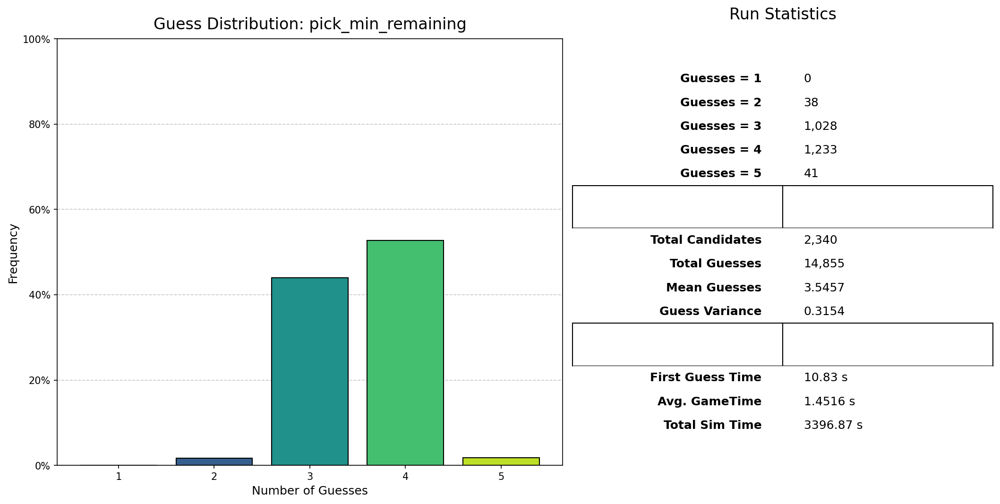

# Wordle Solver (CLI)

A fast, interactive Wordle solver written in Python. It suggests optimal guesses, filters the candidate list based on your feedback (G/Y/B), and can evaluate different guessing strategies across the full answer set.

- Interactive TUI powered by Rich and Typer
- Efficient NumPy-based filtering of candidates
- Default strategy: minimize expected remaining candidates after each guess
- Optional evaluation script to benchmark strategies and produce shareable charts

Performance of the default strategy, as generated by the evaluation script:


## Requirements
- Python 3.12+


## Installation
You can install and run this project either with uv (recommended) or with plain pip.

### Option A: Using uv (recommended)
This repository includes a `uv.lock` and uses dependency groups for dev tooling.

1) Install uv (if you don’t already have it):
   - macOS / Linux: `curl -LsSf https://astral.sh/uv/install.sh | sh`
   - Windows (PowerShell): `irm https://astral.sh/uv/install.ps1 | iex`

2) Sync dependencies:
```
uv sync
```

3) Run the CLI:
```
uv run wordle-solver main
```

4) (Optional) Run tests and tooling:
```
uv run pytest
uv run black .
uv run isort .
```

### Option B: Using pip
1) Create/activate a virtual environment (optional but recommended).

2) Install the package:
```
pip install .
```

3) Run the CLI:
```
wordle-solver main
```

If your shell can’t find the command after a local install, try `python -m wordle.main`.


## Quick start
Run the solver and follow the prompts:
```
wordle-solver main
```
You’ll see the remaining possible words, a suggested guess, and then be asked to:
- Enter your actual guess (press Enter to accept the suggestion), and
- Enter the Wordle response as a string of G/Y/B characters of the same length as the word:
  - G = Green (correct letter, correct position)
  - Y = Yellow (correct letter, wrong position)
  - B = Black/Gray (letter not in the word)

Example interaction for a 5-letter game:
- Suggested Guess: ARISE
- You type your guess (or accept ARISE)
- Wordle shows e.g. BYYGB → you enter `BYYGB`
The solver filters the candidate list and suggests the next guess. Repeat until you win (GGGGG) or no words remain.


## Custom word lists
The CLI accepts optional positional arguments: a candidate (answer) list and a full valid guess list. Both files should contain whitespace-separated words (one per line is fine). All words must have the same length (default 5).

Usage:
```
wordle-solver main PATH/TO/candidates.txt PATH/TO/guesses.txt
```
Notes:
- The candidate list is the set of possible “true answers”.
- The guess list is the full allowed set of guesses you can enter.
- If any candidate is missing from the guess list, the solver will automatically add it so it can be guessed.
- Default lists are bundled with the package:
  - `src/wordle/words/candidates.txt`
  - `src/wordle/words/guesses.txt`


## How it works (high level)
- Words are represented as compact NumPy arrays of bytes for fast vectorized filtering.
- After each guess/response, the solver applies positional and count constraints across the remaining candidates.
- The default suggestion strategy is “minimize expected remaining candidates”, which computes all responses a guess would produce across remaining candidates and picks the guess that best partitions the space.

Additional strategy available in code:
- Letter frequency heuristic (maximize sum of unique letter frequencies).

Currently the interactive CLI uses the “minimize expected remaining” strategy by default.


## Evaluation and charts (optional)
There is an evaluation script that runs strategy benchmarks across the full candidate set and produces a JSON summary and a shareable chart image.

Run locally (not exposed as a console script):
```
python -m wordle.eval
```
Results will be saved under `src/wordle/eval/<run_id>/` (JSON and `share.png`). Example output already in the repo:
- `src/wordle/eval/pick_min_remaining_2340_-1_ce871cd72b04/share.png`
- `src/wordle/eval/pick_letter_freq_2340_14855_febe0ac6e5d5/share.png`

You can open these images to compare strategy performance.


## Command reference
Show top-level help:
```
wordle-solver --help
```
Show help for the main command:
```
wordle-solver main --help
```


## Project layout
- `src/wordle/main.py` — Typer CLI app (interactive solver)
- `src/wordle/solver.py` — Core filtering logic, response computation utilities
- `src/wordle/pick.py` — Guess selection strategies
- `src/wordle/eval.py` — Strategy evaluation and chart generation
- `src/wordle/words/` — Default candidate and guess lists


## Troubleshooting
- “No possible words match the given clues”: The provided guess/response may be inconsistent. Re-check the G/Y/B pattern you entered.
- The solver assumes all words are the same length. Mixed-length inputs are ignored and logged when loading custom lists.
- If the CLI command is not found after installation, try `python -m wordle.main` or ensure your virtual environment’s bin directory is on PATH.


## Development
Using uv:
```
uv sync --group dev
uv run pytest
uv run black .
uv run isort .
```

Using plain Python:
- Runtime deps: `pip install .`
- Dev tools are specified in the `dependency-groups.dev` section (used by uv). You can install them manually if you prefer (black, isort, pytest, deptry).

The entry point is defined in `pyproject.toml` as `wordle-solver = "wordle.main:app"` (Typer app).